I'm passionate about learning software development one step at a time.

Currently, I'm focusing on building strong programming fundamentals, creating real-world projects, and making meaningful open-source contributions.

---

## 🖥️ Terminal

<h3><code>pranav@github ~ $ ./profile.sh</code></h3>

<table>
<tr>

<td valign="top" width="42%">

<h4 align="center"><code>cat ./profile.txt</code></h4>

</td>

<td valign="top" width="58%">

<h4 align="center"><code>./contributions.sh</code></h4>

</td>

</tr>
</table>

---

## 🌱 Currently Learning

- 💻 C Programming
- 🤖 Artificial Intelligence
- 🚀 Open Source

---

## 🎯 My Goals

- Build useful software that solves real problems.
- Strengthen my programming and problem-solving skills.
- Contribute to open-source projects.
- Learn by building projects instead of only watching tutorials.
- Grow into a skilled Software Engineer.

---

## 💡 What I'm Working On

- 📚 Learning Java
- 💻 Solving programming problems
- 🤖 Exploring AI projects
- 🌍 Making open-source contributions
- 🚀 Building personal projects

---

## 📈 Current Journey

✔ Learning every day

✔ Building projects

✔ Improving my coding skills

✔ Exploring AI

✔ Contributing to Open Source

---

## 📫 Connect with Me

📧 **Email:** pvsaipranav2007@gmail.com

💼 **LinkedIn:**  
https://www.linkedin.com/in/pratap-veera-sai-pranav-a32353369/

🌐 **Portfolio:**  
https://overview-gamma-nine.vercel.app/

---

> **"Every expert was once a beginner who chose to keep learning."** 🚀
